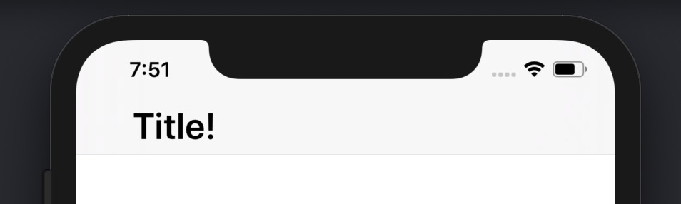
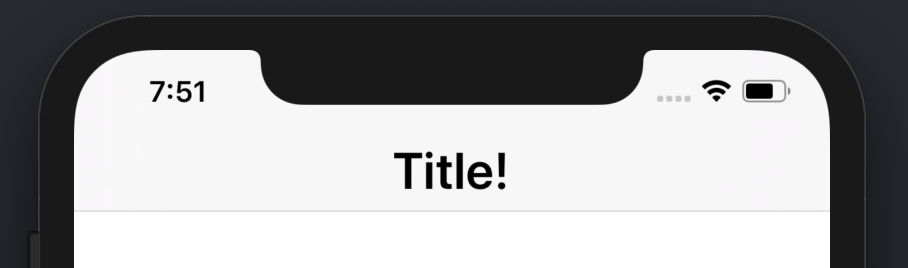

# Custom Title View
A customizable view for use in a NavigationItem's titleView Property


An easy to use UIView class with a UILabel. The label allows for full customization of the `navigiationItem`'s `titleView` property as if you were just setting the `title` property. Especially useful for app that are supporting older version of iOS that do not have the large titles (pre iOS 11).

## Installation
Copy the contents of CustomizeTitleView or add the file into your project.

## Usage
```
//create a view
let titleView = CustomizeTitleView()

//customize in anyway you would like by accessing the label property.
titleView.label.text = "Title!"
titleView.label.font = .boldSystemFont(ofSize: 28)

//optionally add an offset. Default is 0.
titleView.offset = -(UIScreen.main.bounds.width/2 - titleView.titleWidth/2 - 44)

//set to the titleView property
navigationItem.titleView = titleView
```


